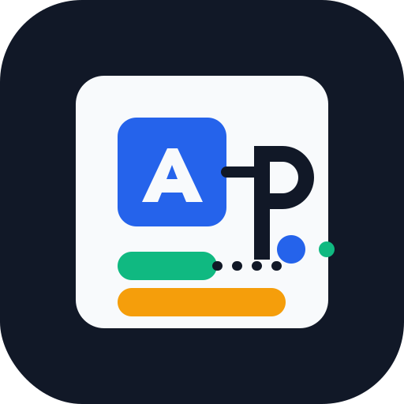

<div align="center">
  <h3><em>面向 Codex Agent 的 PM-first AI 产品 Skill</em></h3>

  <a href="./ai-product-pm-style/SKILL.md">
    
  </a>

  <p>
    <a href="./ai-product-pm-style/SKILL.md">
      
    </a>
    <a href="#安装">
      
    </a>
  </p>

  <p>
    <strong>一个可迁移的 Codex skill，用于 AI/SaaS 产品工作：</strong>
    PM-first brainstorming、API 与 Agent 架构、prompt 纪律、Harness 约束、模块化实现、清晰 UI 文案，以及 GitHub prototype 研究。
  </p>

  <p>
    <a href="https://github.com/LechuanWANG/ai-product-pm-style/stargazers">
      
    </a>
    <a href="./ai-product-pm-style/references/open-source-ideas.md">
      
    </a>
    <a href="./ai-product-pm-style/agents/openai.yaml">
      
    </a>
  </p>

  <p>
    <a href="#设计原则">
      
    </a>
    <a href="./ai-product-pm-style/SKILL.md#ai-%E4%BA%A7%E5%93%81%E6%9E%B6%E6%9E%84%E5%81%8F%E5%A5%BD">
      
    </a>
    <a href="#设计原则">
      
    </a>
  </p>
</div>

# AI 产品经理风格 Skill

一个面向 Codex 的个人产品经理风格 skill，用来让 AI 在做 AI/SaaS 产品 brainstorming、方案设计、功能实现和实现后解释时，更贴近产品经理视角，而不是只从代码视角推进。

English version is available below: [English](#english).

## 适用场景

这个 skill 特别适合以下场景：

- 设计 AI SaaS 产品、API-backed AI 功能或 Agent 工作流
- 根据软件特性和执行计划，为 app、网站、工具或 SaaS 选择合适的计算机语言和技术栈
- 规划 LangChain、LangGraph 或类似 Agent orchestration 架构
- 控制 system prompt、user prompt 和上下文预算
- 用 Harness 思想约束 AI 输入、输出、工具边界和校验点
- 做重大产品更新前的需求澄清、方案拆解和阶段计划
- 从 GitHub prototype 或开源项目里提炼可借鉴的技术特点
- 用项目内 LLM Wiki 记录可复用踩坑经验，避免重复犯同类错误
- 写完代码后，用 PM 能理解的方式解释产品结果、架构变化和风险

## Skill 内容

```text
ai-product-pm-style/
├── SKILL.md
├── agents/
│   └── openai.yaml
├── assets/
│   ├── ai-product-pm-style.svg
│   └── ai-product-pm-style-small.svg
└── references/
    ├── agent-harness.md
    ├── brainstorming.md
    ├── implementation-summary.md
    ├── llm-wiki-protocol.md
    ├── prompt-context.md
    └── open-source-ideas.md
```

## 安装

使用 Codex 的 `$skill-installer`，通过 GitHub 目录 URL 安装：

```text
$skill-installer install https://github.com/LechuanWANG/ai-product-pm-style/tree/main/ai-product-pm-style
```

也可以按仓库和路径安装：

```text
$skill-installer install ai-product-pm-style from LechuanWANG/ai-product-pm-style
```

安装完成后，重启 Codex，让它重新发现这个 skill。

## 使用示例

```text
Use $ai-product-pm-style 帮我 brainstorm 一个面向销售团队的 AI 客户摘要功能。
```

```text
Use $ai-product-pm-style 评审这个 Agent 工作流，看 prompt、context 和 Harness 约束有没有问题。
```

```text
Use $ai-product-pm-style 帮我基于 GitHub 上类似 prototype 的技术特点，设计一个可落地的 AI SaaS 功能方案。
```

```text
Use $ai-product-pm-style 按我的产品风格解释你刚刚实现的代码改动。
```

## 设计原则

- 产品逻辑先于代码细节。
- Brainstorming 阶段要根据目标平台、交互复杂度、AI/API 集成、数据处理、部署和维护成本选择合适的计算机语言与技术栈。
- Prompt 和上下文要克制，不盲目堆砌。
- Harness 要明确输入、输出、工具边界、校验点和失败处理。
- 鼓励技术性创新，但要先用 prototype 或小范围实现验证。
- 主动从 GitHub prototype 和开源项目中提炼技术特点、架构模式和工程组织方式。
- 可复用踩坑经验沉淀到具体项目的 `docs/ai-wiki/`，skill 只保留反思协议。
- 代码结构要清晰、模块化、便于后续产品迭代。
- UI 要简约、好看、切题，文案要短、准、具体。

## 开源项目研究记录

当任务需要借鉴 GitHub 项目或公开 prototype 时，使用 `references/open-source-ideas.md` 作为记录格式。它会记录：

- 来源项目链接
- 许可证和观察日期
- 可借鉴的技术思路
- 对产品方案的启发
- 依赖、许可证和安全风险

## 渐进式参考资料

主 `SKILL.md` 保持简洁，并把不同任务需要的细节分流到独立 reference：

- `references/brainstorming.md`：用于产品 brainstorming、重大更新、MVP 拆解和语言/技术栈选择
- `references/prompt-context.md`：用于 prompt、context、schema、retrieval 和输出契约
- `references/agent-harness.md`：用于 Agent workflow、tool contract、Harness 边界、校验和 fallback
- `references/implementation-summary.md`：用于实现结构、UI 文案、验证和实现后解释
- `references/llm-wiki-protocol.md`：用于项目内 LLM Wiki 反思协议

## 仓库格式

这个仓库采用常见的 Codex skill 分发格式：skill 是一个自包含目录，包含 `SKILL.md`、`agents/openai.yaml`，以及可选的 `assets/` 和 `references/`。根目录 README 负责说明安装与使用方式，真正的可执行 skill 指令位于 `ai-product-pm-style/SKILL.md`。

---

<a id="english"></a>

# AI Product PM Style Skill

A personal product-manager-style skill for Codex. It helps AI approach AI/SaaS product brainstorming, solution design, implementation, and post-implementation explanations from a product manager's perspective instead of driving only from code details.

## Use Cases

This skill is especially useful for:

- Designing AI SaaS products, API-backed AI features, or Agent workflows
- Choosing the right programming language and technology stack for apps, websites, tools, or SaaS products based on product traits and execution plans
- Planning LangChain, LangGraph, or similar Agent orchestration architectures
- Managing system prompts, user prompts, and context budgets
- Applying Harness-style constraints to AI inputs, outputs, tool boundaries, and validation checkpoints
- Clarifying requirements, breaking down plans, and staging major product updates
- Extracting reusable technical patterns from GitHub prototypes or open-source projects
- Recording reusable lessons in a project-local LLM Wiki to avoid repeating product, prompt, Agent, implementation, or UX mistakes
- Explaining product results, architecture changes, and risks in terms a PM can evaluate after implementation

## Skill Contents

```text
ai-product-pm-style/
├── SKILL.md
├── agents/
│   └── openai.yaml
├── assets/
│   ├── ai-product-pm-style.svg
│   └── ai-product-pm-style-small.svg
└── references/
    ├── agent-harness.md
    ├── brainstorming.md
    ├── implementation-summary.md
    ├── llm-wiki-protocol.md
    ├── prompt-context.md
    └── open-source-ideas.md
```

## Install

Use Codex's `$skill-installer` with the GitHub directory URL:

```text
$skill-installer install https://github.com/LechuanWANG/ai-product-pm-style/tree/main/ai-product-pm-style
```

Or install by repo and path:

```text
$skill-installer install ai-product-pm-style from LechuanWANG/ai-product-pm-style
```

After installing, restart Codex so it can pick up the new skill.

## Usage Examples

```text
Use $ai-product-pm-style 帮我 brainstorm 一个面向销售团队的 AI 客户摘要功能。
```

```text
Use $ai-product-pm-style 评审这个 Agent 工作流，看 prompt、context 和 Harness 约束有没有问题。
```

```text
Use $ai-product-pm-style 帮我基于 GitHub 上类似 prototype 的技术特点，设计一个可落地的 AI SaaS 功能方案。
```

```text
Use $ai-product-pm-style 按我的产品风格解释你刚刚实现的代码改动。
```

## Design Principles

- Product logic comes before code details.
- During brainstorming, choose the programming language and technology stack based on target platform, interaction complexity, AI/API integration, data processing, deployment, and maintenance cost.
- Prompts and context should stay disciplined instead of accumulating unnecessary instructions.
- Harness boundaries should define inputs, outputs, tool boundaries, validation checkpoints, and failure handling.
- Technical innovation is encouraged, but validate it first with a prototype or narrow implementation.
- Actively extract technical ideas, architecture patterns, and engineering organization from GitHub prototypes and open-source projects.
- Reusable lessons should be stored in the current project's `docs/ai-wiki/`; the skill only keeps the reflection protocol.
- Code structure should stay clear, modular, and easy to iterate on.
- UI should be simple, polished, and context-aware. Copy should be short, precise, and concrete.

## Open Source Research Notes

When a task borrows from GitHub projects or public prototypes, use `references/open-source-ideas.md` as the note-taking format. It records:

- source project links
- license and observed date
- borrowable technical ideas
- product implications
- dependency, license, and security risks

## Progressive References

The main `SKILL.md` stays concise and routes task-specific details into focused references:

- `references/brainstorming.md` for product brainstorming, major updates, MVP planning, and language/stack selection
- `references/prompt-context.md` for prompt, context, schema, retrieval, and output contracts
- `references/agent-harness.md` for Agent workflow, tool contracts, Harness boundaries, validation, and fallback
- `references/implementation-summary.md` for implementation structure, UI copy, validation, and post-implementation explanation
- `references/llm-wiki-protocol.md` for project-local LLM Wiki reflection protocol

## Repository Format

This repository follows the common Codex skill distribution pattern: the skill is a self-contained folder with `SKILL.md`, `agents/openai.yaml`, optional `assets/`, and optional `references/`. The root README explains installation and usage, while the executable skill instructions live inside `ai-product-pm-style/SKILL.md`.
