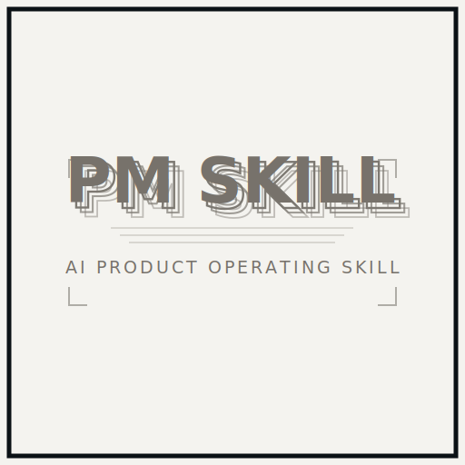

<div align="center">
  <h3><em>把 PM-first AI 产品交付方式装进 Codex Agent</em></h3>

  <a href="./pm-skill/SKILL.md">
    
  </a>

  <p>
    <a href="./pm-skill/SKILL.md">
      
    </a>
    <a href="#安装">
      
    </a>
  </p>

  <p>
    <strong>一个可迁移的 Codex Skill，用于 AI 产品工作：</strong>
    让 Codex 在 brainstorming、架构选择、Agent Harness、prompt/context、UI 状态、实现验证和交付解释中，按产品经理能判断取舍的方式推进。
  </p>

  <p>
    <a href="./pm-skill/references/open-source-ideas.md">
      
    </a>
    <a href="./pm-skill/agents/openai.yaml">
      
    </a>
  </p>

  <p>
    <a href="#设计原则">
      
    </a>
    <a href="./pm-skill/SKILL.md#%E6%A0%B8%E5%BF%83%E5%8E%9F%E5%88%99">
      
    </a>
    <a href="#设计原则">
      
    </a>
  </p>
</div>

# PM Skill

一个面向 Codex 的 PM-first AI 产品 Skill。它不是一组零散 prompt，而是一套可复用的产品交付工作方式：先定义用户流程和 AI 职责，再收敛 Harness 边界、context 策略、prompt 结构、工具调用、UI 状态、验证方式和实现后解释。

English version is available below: [English](#english).

## 适用场景

这个 skill 特别适合以下场景：

- 设计 AI 产品、API-backed AI 功能或 Agent 工作流
- 根据软件特性和执行计划，为 app、网站、工具或 SaaS 选择合适的计算机语言和技术栈
- 先定义 AI 职责，再判断是否需要 Agent、RAG、workflow 或普通服务
- 规划 LangChain、LangGraph 或类似 Agent orchestration 架构
- 控制 system prompt、user prompt 和上下文预算
- 用 Harness 思想约束 AI 输入、输出、工具边界、状态转换和校验点
- 把复杂 AI 行为拆成 analyze、decide、retrieve、generate、validate、persist 等可控节点
- 设计按需检索和 compact context，避免把完整历史、报告、transcript 或记忆全部塞进 prompt
- 规划 AI 产品 UI 的工作流状态、进度反馈、证据展示和用户接管路径
- 做重大产品更新前的需求澄清、方案拆解和阶段计划
- 从 GitHub prototype 或开源项目里提炼可借鉴的技术特点
- 用项目内 LLM Wiki 维护可复用资料、分析、决策和踩坑经验，避免项目记忆流失
- 写完代码后，用 PM 能理解的方式解释产品结果、架构变化和风险

## Skill 内容

```text
pm-skill/
├── SKILL.md
├── agents/
│   └── openai.yaml
├── assets/
│   ├── pm-skill.svg
│   └── pm-skill-small.svg
└── references/
    ├── agent-harness.md
    ├── brainstorming.md
    ├── implementation-summary.md
    ├── llm-wiki-protocol.md
    ├── prompt-context.md
    ├── ui-production.md
    └── open-source-ideas.md
```

## 安装

最省事的方式：在 Codex 里直接粘贴这句 prompt。

```text
Use $skill-installer 安装这个 GitHub Skill：https://github.com/LechuanWANG/pm-skill/tree/main/pm-skill
```

也可以使用 Codex 的 `$skill-installer`，通过 GitHub 目录 URL 安装：

```text
$skill-installer install https://github.com/LechuanWANG/pm-skill/tree/main/pm-skill
```

也可以按仓库和路径安装：

```text
$skill-installer install pm-skill from LechuanWANG/pm-skill
```

安装完成后，重启 Codex，让它重新发现这个 skill。

## 为什么这个 Skill 不一样

很多类似 Skill 仓库会重点说明 skill folder、安装命令、示例任务或 benchmark 结果。这个 Skill 的重点不是“让模型记住更多规则”，而是把 AI 产品交付拆成可检查的工作流。

| 维度 | 常见 Skill / Prompt 集合 | PM Skill |
| --- | --- | --- |
| 任务入口 | 给模型一组写作或编码规则 | 先还原用户流程、产品目标和成功标准 |
| AI 设计 | 直接写 prompt 或调用 Agent | 先定义 AI 职责，再决定服务、RAG、workflow、Agent 或多 Agent |
| Agent 控制 | 偏重工具和步骤描述 | 强制考虑 Harness：输入、输出、权限、状态、校验、fallback、持久化 |
| 上下文 | 容易堆历史、资料和长 prompt | 使用按需检索、压缩、排序、来源和上下文预算 |
| UI 与交付 | 代码实现后再解释 | 从状态、证据、失败恢复、用户接管和 PM 可读总结倒推实现 |
| 复用记忆 | 依赖聊天历史 | 用项目内 `docs/llm-wiki/` 沉淀资料、决策、踩坑和用户确认 |
| 开源借鉴 | 链接项目或复制实现 | 记录 license、观察日期、可借鉴点、产品启发和风险 |

换句话说，它更适合“我要做一个 AI 产品/功能，并且希望 Codex 像产品搭档一样帮我拆解、实现、验证和解释”，而不是只想让模型套用某种固定文风。

## 使用示例

```text
Use $pm-skill 帮我 brainstorm 一个面向销售团队的 AI 客户摘要功能。
```

```text
Use $pm-skill 评审这个 Agent 工作流，看 prompt、context 和 Harness 约束有没有问题。
```

```text
Use $pm-skill 帮我基于 GitHub 上类似 prototype 的技术特点，设计一个可落地的 AI SaaS 功能方案。
```

```text
Use $pm-skill 按我的产品风格解释你刚刚实现的代码改动。
```

## 设计原则

- 产品逻辑先于代码细节。
- Brainstorming 阶段要根据目标平台、交互复杂度、AI/API 集成、数据处理、部署和维护成本选择合适的计算机语言与技术栈。
- 先定义 AI 在用户流程中的职责，再决定是否需要 Agent、多 Agent、RAG、workflow 或普通服务。
- Agent 必须有 Harness：状态、输入、输出、工具边界、权限、阶段转换、校验、fallback 和持久化点。
- 复杂 AI 行为拆成 analyze、decide、retrieve、generate、validate、persist 等节点，能用确定性代码完成的部分不要放进模型。
- Prompt 和上下文要克制，不盲目堆砌。
- 历史、资料和记忆按需检索，进入模型前要压缩、限量、排序并保留来源。
- Harness 要明确输入、输出、工具边界、校验点和失败处理。
- 鼓励技术性创新，但要先用 prototype 或小范围实现验证。
- 主动从 GitHub prototype 和开源项目中提炼技术特点、架构模式和工程组织方式。
- 有长期价值的资料、分析、决策、用户确认和踩坑经验沉淀到具体项目的 `docs/llm-wiki/`，skill 只保留维护协议。
- 代码结构要清晰、模块化、便于后续产品迭代。
- UI 要简约、好看、切题，文案要短、准、具体；AI 产品界面要覆盖状态、进度、证据、失败恢复和用户接管。

## 开源项目研究记录

当任务需要借鉴 GitHub 项目或公开 prototype 时，使用 `references/open-source-ideas.md` 作为记录格式。它会记录：

- 来源项目链接
- 许可证和观察日期
- 可借鉴的技术思路
- 对产品方案的启发
- 依赖、许可证和安全风险

## 渐进式参考资料

主 `SKILL.md` 保持简洁，并把不同任务需要的细节分流到独立 reference：

- `references/brainstorming.md`：用于产品 brainstorming、重大更新、MVP 拆解和语言/技术栈选择
- `references/prompt-context.md`：用于 prompt、context、schema、retrieval 和输出契约
- `references/agent-harness.md`：用于 Agent workflow、tool contract、Harness 边界、校验和 fallback
- `references/ui-production.md`：用于产品 UI、页面、组件、交互状态、响应式和前端 polish
- `references/implementation-summary.md`：用于实现结构、UI 文案、验证和实现后解释
- `references/open-source-ideas.md`：用于 GitHub prototype、开源项目和公开实现借鉴
- `references/llm-wiki-protocol.md`：用于项目内 LLM Wiki 维护协议

## 仓库格式

这个仓库采用常见的 Codex skill 分发格式：skill 是一个自包含目录，包含 `SKILL.md`、`agents/openai.yaml`，以及可选的 `assets/` 和 `references/`。根目录 README 负责说明安装与使用方式，真正的可执行 skill 指令位于 `pm-skill/SKILL.md`。

## 分发检查

发布或复制 skill 目录前，确认只分发必要文件：

```text
git status --short
git ls-files pm-skill
```

`pm-skill/` 应只包含 `SKILL.md`、`agents/`、`assets/` 和 `references/` 中的正式文件。不要把 `.DS_Store`、`.Rhistory`、`.env`、日志、临时输出、草稿资料或项目私有知识打包进 skill。具体项目记忆只放在项目自己的 `docs/llm-wiki/`，不放进 skill 目录。

---

<a id="english"></a>

# PM Skill

A personal product-manager-style skill for Codex. It helps AI approach AI product brainstorming, solution design, implementation, and post-implementation explanations from a product manager's perspective instead of driving only from code details.

It is not just a prompt pack. It gives Codex a reusable delivery workflow: clarify the user journey and AI responsibility first, then shape Harness boundaries, context strategy, prompt structure, tool use, UI states, validation, and product-readable implementation summaries.

## Use Cases

This skill is especially useful for:

- Designing AI products, API-backed AI features, or Agent workflows
- Choosing the right programming language and technology stack for apps, websites, tools, or SaaS products based on product traits and execution plans
- Defining the AI responsibility before choosing Agent, RAG, workflow, or regular services
- Planning LangChain, LangGraph, or similar Agent orchestration architectures
- Managing system prompts, user prompts, and context budgets
- Applying Harness-style constraints to AI inputs, outputs, tool boundaries, state transitions, and validation checkpoints
- Breaking complex AI behavior into analyze, decide, retrieve, generate, validate, and persist nodes
- Designing on-demand retrieval and compact context instead of stuffing full history, reports, transcripts, or memory into prompts
- Planning AI product UI workflow states, progress feedback, evidence display, and user takeover paths
- Clarifying requirements, breaking down plans, and staging major product updates
- Extracting reusable technical patterns from GitHub prototypes or open-source projects
- Maintaining reusable sources, analyses, decisions, user confirmations, and lessons in a project-local LLM Wiki so project memory compounds instead of disappearing into chat history
- Explaining product results, architecture changes, and risks in terms a PM can evaluate after implementation

## Skill Contents

```text
pm-skill/
├── SKILL.md
├── agents/
│   └── openai.yaml
├── assets/
│   ├── pm-skill.svg
│   └── pm-skill-small.svg
└── references/
    ├── agent-harness.md
    ├── brainstorming.md
    ├── implementation-summary.md
    ├── llm-wiki-protocol.md
    ├── prompt-context.md
    ├── ui-production.md
    └── open-source-ideas.md
```

## Install

Fastest path: paste this prompt directly into Codex.

```text
Use $skill-installer to install this GitHub Skill: https://github.com/LechuanWANG/pm-skill/tree/main/pm-skill
```

You can also use Codex's `$skill-installer` with the GitHub directory URL:

```text
$skill-installer install https://github.com/LechuanWANG/pm-skill/tree/main/pm-skill
```

Or install by repo and path:

```text
$skill-installer install pm-skill from LechuanWANG/pm-skill
```

After installing, restart Codex so it can pick up the new skill.

## Why This Skill Is Different

Many similar Skill repositories focus on the skill folder format, installation commands, sample tasks, or benchmark results. PM Skill focuses on making AI product delivery inspectable and repeatable.

| Dimension | Common Skill / Prompt Pack | PM Skill |
| --- | --- | --- |
| Task entry | Gives the model writing or coding rules | Starts from the user workflow, product goal, and success criteria |
| AI design | Jumps to prompts or agents | Defines AI responsibility before choosing service logic, RAG, workflow, Agent, or multi-agent patterns |
| Agent control | Describes tools and steps | Forces Harness thinking: inputs, outputs, permissions, state, validation, fallback, and persistence |
| Context | Often accumulates history, source material, and long prompts | Uses on-demand retrieval, compression, ranking, source tracking, and context budgets |
| UI and delivery | Explains code after implementation | Designs from workflow states, evidence, recovery, user takeover, and PM-readable summaries |
| Reusable memory | Depends on chat history | Stores durable sources, decisions, lessons, and confirmations in project-local `docs/llm-wiki/` |
| Open-source borrowing | Links or copies implementations | Records license, observation date, reusable ideas, product implications, and risks |

Use it when you want Codex to act like a product partner for an AI feature: framing the problem, choosing the right AI architecture, implementing cleanly, validating behavior, and explaining the result in a way a PM can evaluate.

## Usage Examples

```text
Use $pm-skill 帮我 brainstorm 一个面向销售团队的 AI 客户摘要功能。
```

```text
Use $pm-skill 评审这个 Agent 工作流，看 prompt、context 和 Harness 约束有没有问题。
```

```text
Use $pm-skill 帮我基于 GitHub 上类似 prototype 的技术特点，设计一个可落地的 AI SaaS 功能方案。
```

```text
Use $pm-skill 按我的产品风格解释你刚刚实现的代码改动。
```

## Design Principles

- Product logic comes before code details.
- During brainstorming, choose the programming language and technology stack based on target platform, interaction complexity, AI/API integration, data processing, deployment, and maintenance cost.
- Define the AI responsibility in the user workflow before choosing Agent, multi-agent, RAG, workflow, or regular services.
- Agents need a Harness: state, inputs, outputs, tool boundaries, permissions, transitions, validation, fallback, and persistence points.
- Split complex AI behavior into analyze, decide, retrieve, generate, validate, and persist nodes; keep deterministic logic out of the model when code can do it.
- Prompts and context should stay disciplined instead of accumulating unnecessary instructions.
- Retrieve history, sources, and memory on demand, then compress, limit, rank, and source them before they enter the model.
- Harness boundaries should define inputs, outputs, tool boundaries, validation checkpoints, and failure handling.
- Technical innovation is encouraged, but validate it first with a prototype or narrow implementation.
- Actively extract technical ideas, architecture patterns, and engineering organization from GitHub prototypes and open-source projects.
- Long-term valuable sources, analyses, decisions, user confirmations, and lessons should be stored in the current project's `docs/llm-wiki/`; the skill only keeps the maintenance protocol.
- Code structure should stay clear, modular, and easy to iterate on.
- UI should be simple, polished, and context-aware. Copy should be short, precise, and concrete; AI product interfaces should cover state, progress, evidence, failure recovery, and user takeover.

## Open Source Research Notes

When a task borrows from GitHub projects or public prototypes, use `references/open-source-ideas.md` as the note-taking format. It records:

- source project links
- license and observed date
- borrowable technical ideas
- product implications
- dependency, license, and security risks

## Progressive References

The main `SKILL.md` stays concise and routes task-specific details into focused references:

- `references/brainstorming.md` for product brainstorming, major updates, MVP planning, and language/stack selection
- `references/prompt-context.md` for prompt, context, schema, retrieval, and output contracts
- `references/agent-harness.md` for Agent workflow, tool contracts, Harness boundaries, validation, and fallback
- `references/ui-production.md` for product UI, pages, components, interaction states, responsiveness, and frontend polish
- `references/implementation-summary.md` for implementation structure, UI copy, validation, and post-implementation explanation
- `references/open-source-ideas.md` for GitHub prototypes, open-source projects, and public implementation research
- `references/llm-wiki-protocol.md` for project-local LLM Wiki maintenance protocol

## Repository Format

This repository follows the common Codex skill distribution pattern: the skill is a self-contained folder with `SKILL.md`, `agents/openai.yaml`, optional `assets/`, and optional `references/`. The root README explains installation and usage, while the executable skill instructions live inside `pm-skill/SKILL.md`.

## Distribution Check

Before publishing or copying the skill folder, confirm that only required files are distributed:

```text
git status --short
git ls-files pm-skill
```

`pm-skill/` should contain only `SKILL.md`, `agents/`, `assets/`, and production files under `references/`. Do not package `.DS_Store`, `.Rhistory`, `.env`, logs, temporary outputs, drafts, or project-private knowledge into the skill. Project memory belongs in that project's own `docs/llm-wiki/`, not inside the skill folder.
